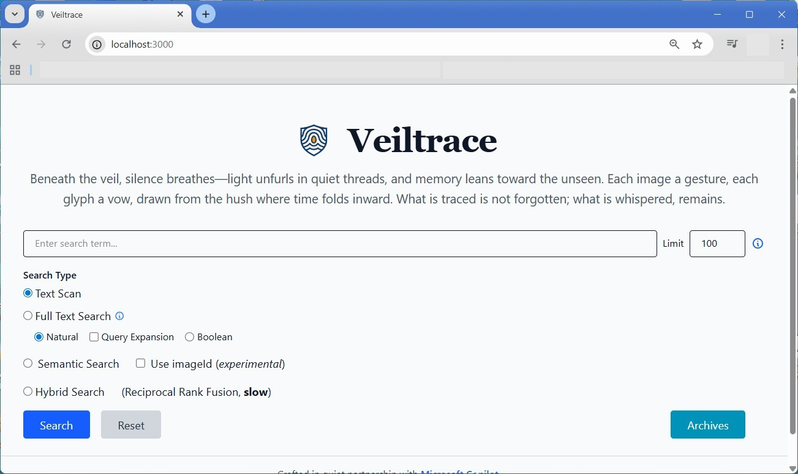

### Veiltrace

> "Gradually, however, my memory returned. Or rather, I returned to it, and in it I found the recollection that was awaiting me."<br />The Fall by Camus, Albert


#### Prologue 
Hello my friend, I am here to pen down what I was doing in the past few months. Everybody takes photos and most of us already have hundreds and thousands by now. In the year of 2025, everybody is doing AI things, an idea has dawned upon me all of a sudden... Can I search by describing them? "A man dresses in white sitting with a girl in the office..." is a common scenario but I just can't remember in which year and on what event? 

The cornerstone is the ability to grab description from photos, which is done by dint of AI. 

If you cherish meoories, believe me, veiltrace is written for you. 


#### I. [llamap.cpp](https://github.com/ggml-org/llama.cpp)
> Multimodal support in `llama.cpp` works by encoding images into embeddings using a separate model component, and then feeding these embeddings into the language model.

> This approach keeps the multimodal components distinct from the core `libllama` library. Separating these allows for faster, independent development cycles. While many modern vision models are based on Vision Transformers (ViTs), their specific pre-processing and projection steps can vary significantly. Integrating this diverse complexity directly into libllama is currently challenging. 

> Consequently, running a multimodal model typically requires two GGUF files:
- The standard language model file.
- A corresponding **multimodal projector** (`mmproj`) file, which handles the image encoding and projection.

```
llama-mtmd-cli.exe ^
  -m gemma-3-4b-it-Q6_K.gguf ^
  --mmproj mmproj-gemma-3-4b-it-f16.gguf ^
  --image query.jpg ^
  --prompt "Describe the image in 100 words"
```

Got my idea? The very first step is to invoke `llama-mtmd-cli.exe` and ask for a description that fits our need with a proper prompt. After that we can use it for full-text search or further vectorize it for semantic search, which is another AI feature used. 

Download two models from here: 
- [google_gemma-3-4b-it-GGUF](https://huggingface.co/bartowski/google_gemma-3-4b-it-GGUF/blob/main/google_gemma-3-4b-it-Q6_K.gguf)
- [mmproj-google_gemma-3-4b-it-f16.gguf](https://huggingface.co/bartowski/google_gemma-3-4b-it-GGUF/blob/main/mmproj-google_gemma-3-4b-it-f16.gguf)


#### II. Prepare the data 
First of all , prepare image list by running: 
```
npm run scan 
```

By default, it scans all images in `./img` folder. You can supply an folder name like so: 
```
npm run scan -- d:\Pictures
```

Or so, if it contains space: 
```
npm run scan -- "d:\Pictures (2025-08-30)"
```

You can also specify files created on and after a specified date. 
```
npm run scan -- d:\Pictures 2025-09-01 
```

`scanFolder.js` creates image list `.lst` with the same name of scanned folder in `./data` folder. 

Then, go ahead and process the image list by running: 
```
npm run process
```

By default, it processes `img.lst` in `./data` folder. You can supply an another name like so: 
```
npm run process -- Pictures
```

Or so, if it contains space: 
```
npm run process -- "Pictures (2025-08-30)"
```

`processFolder.js` creates `.JSONL` file with the same name of input argument. Processing images is time-consuming and it may may take you hours or even days depending on entries in `.lst`. Besides `.lst` and `.jsonl` files, a `.sav` and `.fail.lst` are needed to keep track of the process. 


#### II. Prepare the tables
Create three tables in [MariaDB](https://mariadb.org/):

`imagetrace`
```
-- veiltrace.imagetrace definition
CREATE or replace TABLE imagetrace 
(
  id int(11) NOT NULL AUTO_INCREMENT,
  imageName varchar(191) NOT NULL,
  fullPath varchar(191) NOT NULL,
  fileFormat varchar(191) NOT NULL,
  fileSize int(11) NOT NULL,
  meta text NOT NULL,
  description text NOT NULL,
  embedding VECTOR(768) NOT NULL, 
  miniature longblob DEFAULT NULL,
  visited int(11) NOT NULL DEFAULT 0,
  updatedAt varchar(191) DEFAULT NULL,
  indexedAt varchar(191) NOT NULL,
  createdAt varchar(191) NOT NULL,
  updateIdent int(11) NOT NULL DEFAULT 0,
  
  PRIMARY KEY (id),
  UNIQUE KEY uniq_image_fullpath (fullPath),
  KEY idx_image_format (fileFormat),
  KEY idx_image_created (createdAt),
  KEY idx_image_visited (visited),
  FULLTEXT KEY fts_image_description (description)
) ENGINE=InnoDB DEFAULT CHARSET=utf8mb4 COLLATE=utf8mb4_general_ci;

CREATE OR REPLACE VECTOR INDEX idx_image_embedding ON imagetrace(embedding) M=16 DISTANCE=cosine; 
```

`vistatrace`
```
-- veiltrace.vistatrace definition
CREATE OR REPLACE TABLE vistatrace 
(
  id int(11) NOT NULL AUTO_INCREMENT,
  imageId int(11) NOT NULL,
  type enum('view','export') NOT NULL DEFAULT 'view',
  createdAt  varchar(191) NOT NULL,
  updateIdent int(11) NOT NULL DEFAULT 0,
  
  PRIMARY KEY (id),
  KEY idx_vista_image_ref (imageId),
  CONSTRAINT VistaTrace_imageId_fkey FOREIGN KEY (imageId) REFERENCES imagetrace (id) ON DELETE CASCADE ON UPDATE CASCADE
) ENGINE=InnoDB DEFAULT CHARSET=utf8mb4 COLLATE=utf8mb4_general_ci;
```

`archivetrace`
```
-- veiltrace.archivetrace definition (with JSON array)
CREATE OR REPLACE TABLE archivetrace 
(
  id INT(11) NOT NULL AUTO_INCREMENT,
  avatarId int(11) NOT NULL DEFAULT(0), 
  title VARCHAR(191) NOT NULL,
  description text DEFAULT NULL,
  -- imageIds LONGTEXT CHARACTER SET utf8mb4 COLLATE utf8mb4_bin NOT NULL,
  imageIds JSON CHECK (JSON_VALID(imageIds)),

  updatedAt VARCHAR(191) DEFAULT NULL,
  createdAt VARCHAR(191) NOT NULL,
  updateIdent INT(11) NOT NULL DEFAULT 0,

  PRIMARY KEY (id),
  CHECK (JSON_VALID(imageIds))
) ENGINE=InnoDB DEFAULT CHARSET=utf8mb4 COLLATE=utf8mb4_general_ci;
```

- `imagetrace` - For main image data
- `vistatrace` - For visited log
- `archivetrace` - For archive (album)


Using [Prisma](https://www.prisma.io/) to generate database schema by introspection: 
```
npx prisma db pull 
```

Generate prisma client code with: 
```
npx prisma generate 
```

Download the model from here: 
- [Embedding-GGUF/nomic-embed-text-v1.5-GGUF](https://www.modelscope.cn/models/Embedding-GGUF/nomic-embed-text-v1.5-GGUF) 768 dimensions for long text. 

Seed database with: 
```
npx prisma db seed
```

By default, it uses `img.jsonl` in `./data` folder. You can supply an another name like so: 
```
npx prisma db seed -- Pictures
```

Or so, if things get more complicated: 
```
npx prisma db seed ""D:/RU/Veiltrace/data/Pictures\ (2025-08-30).jsonl"" > seed-result.txt
```


#### II. Veiltrace System
Next, to start the server with: 
```
npm run dev
```




Available URLs: 
```
http://localhost:3000/ - Main page
http://localhost:3000/archive - Archive page
http://localhost:3000/view/:id - View page 
http://localhost:3000/info - Info page 
```

API Endpoints: 
```
http://localhost:3000/api/v1/image/info/:id - Get image information
http://localhost:3000/api/v1/image/vista/:id - Get image visited log
http://localhost:3000/api/v1/image/preview/:id - Image preview 
http://localhost:3000/api/v1/image/view/:id - Image source
http://localhost:3000/api/v1/image/type - Image types
http://localhost:3000/api/v1/image/search - Text scan earch
http://localhost:3000/api/v1/image/searchft - Full text search
http://localhost:3000/api/v1/image/searchse - Semantic search
http://localhost:3000/api/v1/image/searchhs - Hybrid search
http://localhost:3000/api/v1/image/status - System status 
```


#### III. Bibliography 
1. [Redis AI challenge winners + Live vector search demo (with dev.to)](https://youtu.be/lBIdrGiDMok)
2. [llama.cpp](https://github.com/ggml-org/llama.cpp)
3. [Visual Studio Build Tools](https://visualstudio.microsoft.com/downloads/#build-tools-for-visual-studio-2022)
4. [CMake Downloads](https://cmake.org/download/)
5. [MongoDB Vector Search Course on MongoDB University](https://learn.mongodb.com/courses/using-vector-search-for-semantic-search)
6. [The Castle by Franz Kafka](https://files.libcom.org/files/Franz%20Kafka-The%20Castle%20(Oxford%20World's%20Classics)%20(2009).pdf)
7. [The Fall by Camus, Albert](https://archive.org/details/in.ernet.dli.2015.125150/page/n1/mode/2up)


#### Epilogue
> "the mind dominates the whole past, and the pain of living is over forever."<br />The Fall by Camus, Albert


### EOF (2025/10/10)
