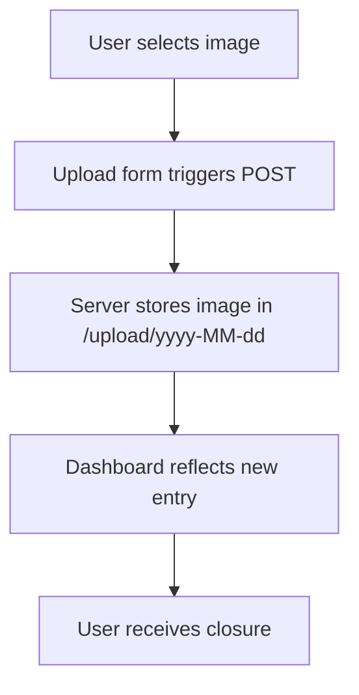
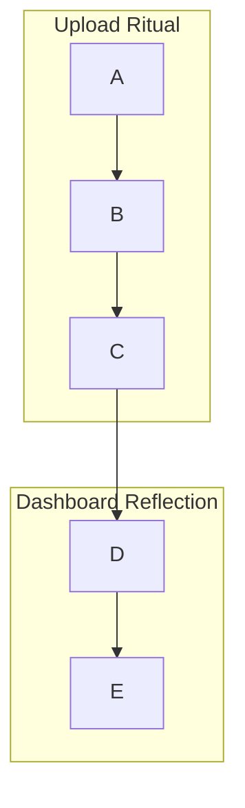
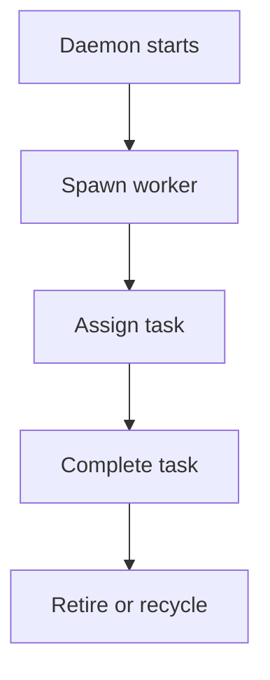

# 🧭 Flowcharting with Mermaid.js: A Ritual Guide for Veiltrace

## 🌊 Introduction: Why Flowcharts Matter

In Veiltrace, every upload, every worker, every dashboard trace is a symbolic gesture. These gestures form a ritual—an invocation of meaning, clarity, and closure. Flowcharts are not just diagrams; they are **maps of intention**. They help you and your collaborators understand the journey of data, the invocation of endpoints, and the breath of the system.

Mermaid.js offers a declarative way to draw these maps using simple text syntax. It’s lightweight, embeddable, and expressive—perfect for documenting Veiltrace’s architecture, upload flow, worker orchestration, and dashboard reflection.

This guide will walk you through everything: how to write Mermaid syntax, render diagrams in your browser, integrate them into Veiltrace, and preview them inside Visual Studio Code.

---

## 🧱 Core Syntax: Building Blocks of a Flowchart

Mermaid flowcharts begin with a direction keyword:

```mermaid
graph TD
```

This means “graph, top-down.” You can also use:
- `graph LR` → Left to right
- `graph RL` → Right to left
- `graph BT` → Bottom to top

### 🔹 Nodes

Nodes are the entities in your system. They can be:
- **Rectangles**: `A[Upload Image]`
- **Round edges**: `B(Validate)`
- **Circles**: `C((Worker))`
- **Diamonds (decisions)**: `D{Is valid?}`
- **Subroutines**: `E[[Archive]]`

Each node has an ID (`A`, `B`, etc.) and a label.

### 🔹 Arrows

Arrows show flow:
- `A --> B` → A flows to B
- `A -->|Yes| B` → A flows to B with label “Yes”
- `A -.-> B` → Dotted arrow
- `A ==> B` → Thick arrow (experimental)

---

## 🧪 Example: Veiltrace Upload Flow



This diagram shows the ritual from user invocation to closure. Each step is a symbolic gesture.

---

## 🧩 Advanced Features

### 🔸 Styling Nodes

You can define styles:

```mermaid
classDef upload fill:#f9f,stroke:#333,stroke-width:2px;
class A,B upload;
```

This gives `A` and `B` a pink background and bold border.

### 🔸 Grouping Nodes

Use subgraphs to group related nodes:



This helps visually separate phases of your system.

---

## 🧠 Use Cases in Veiltrace

### 1. **Upload Flow**
Document how images move from user to archive.

### 2. **Worker Pool Lifecycle**
Show how workers are spawned, assigned, and retired.



### 3. **Queue Management**
Visualize how tasks enter, wait, and exit the queue.

### 4. **Dashboard Rendering**
Trace how data flows into the dashboard and becomes visible.

---

## 🧾 Integration into Veiltrace Website

### 🧱 Folder Setup

Place your diagram file here:

```
veiltrace/
├── docs/
│   └── mermaid.md
```

Example content of `mermaid.md`:


---

### 🧾 Express Route to Serve `mermaid.md`

In `routes/docs.js`:

```js
const fs = require('fs/promises');
const express = require('express');
const router = express.Router();

router.get('/mermaid', async (req, res) => {
  try {
    const content = await fs.readFile('./docs/mermaid.md', 'utf8');
    res.render('mermaid-doc', { diagram: content });
  } catch (err) {
    console.error('[Veiltrace] Failed to read mermaid.md:', err);
    res.status(500).send('Diagram not found.');
  }
});

module.exports = router;
```

In `app.js`:

```js
app.use('/docs', require('./routes/docs'));
```

---

### 🎨 EJS Template to Render Mermaid

Create `views/mermaid-doc.ejs`:

```html
<!DOCTYPE html>
<html lang="en">
<head>
  <meta charset="UTF-8" />
  <title>Veiltrace Diagrams</title>
  <script type="module">
    import mermaid from 'https://cdn.jsdelivr.net/npm/mermaid@10/dist/mermaid.esm.min.mjs';
    mermaid.initialize({ startOnLoad: true });
  </script>
  <style>
    body { font-family: sans-serif; padding: 2rem; background: #f9f9f9; }
    .mermaid { background: #fff; padding: 1rem; border-radius: 8px; box-shadow: 0 0 10px rgba(0,0,0,0.1); margin-bottom: 2rem; }
  </style>
</head>
<body>
  <h1>📜 Veiltrace Documentation</h1>
  <div class="mermaid"><%= diagram %></div>
</body>
</html>
```

---

### 🧪 Visit the Ritual

Start your server and visit:

```
http://localhost:3000/docs/mermaid
```

You’ll see the diagram rendered from `mermaid.md`.

---

## 🧾 Exporting and Sharing

You can export Mermaid diagrams as:
- PNG/SVG (via Mermaid Live Editor)
- PDF (via Markdown Preview Enhanced in VS Code)
- Embed in documentation or README

---

## 🧰 Tools and Extensions

### 🔹 Mermaid Live Editor

🔗 [https://mermaid.live](https://mermaid.live)  
Preview and test diagrams instantly.

---

## 🧩 Installing Mermaid Plugins in Visual Studio Code

To render and preview Mermaid diagrams inside VS Code—whether embedded in `.md` files or standalone `.mmd` files—you’ll need one of the following extensions. These tools transform your editor into a living altar for diagrammatic invocation.

---

### 🔹 Option 1: Markdown Preview Mermaid Support

📦 **Extension Name**: `vscode-mermaid-preview`  
🔗 [Install from Marketplace](https://marketplace.visualstudio.com/items?itemName=vstirbu.vscode-mermaid-preview)

#### 🧾 Features:
- Renders Mermaid diagrams inside Markdown preview (`.md`)
- Lightweight and focused on Mermaid syntax
- Works with fenced code blocks (` ```mermaid `)

#### 🧭 How to Use:
1. Open your `mermaid.md` file.
2. Write a diagram like:

   ```markdown
   ```mermaid
   graph TD
     A --> B
     B --> C
   ```
   ```

3. Press `Ctrl+Shift+V` or right-click → “Open Preview”

---

### 🔹 Option 2: Markdown Preview Enhanced

📦 **Extension Name**: `markdown-preview-enhanced`  
🔗 [Install from Marketplace](https://marketplace.visualstudio.com/items?itemName=shd101wyy.markdown-preview-enhanced)

#### 🧾 Features:
- Supports Mermaid, LaTeX, charts, and more
- Export to PDF/HTML with diagrams
- Ideal for documentation rituals

#### 🧭 How to Use:
1. Install the extension.
2. Open your `mermaid.md` file.
3. Use the command palette: `Markdown Preview Enhanced: Open Preview`
4. You’ll see a live rendering of your diagram.

---

### 🔹 Option 3: Mermaid Editor

📦 **Extension Name**: `vscode-mermaid-editor`  
🔗 [Install from Marketplace](https://marketplace.visualstudio.com/items?itemName=tomoyukim.vscode-mermaid-editor)

#### 🧾 Features:
- Dedicated Mermaid diagram editor
- Opens `.mmd` files with live preview
- Supports zoom, pan, and export

#### 🧭 How to Use:
1. Create a `.mmd` file with Mermaid syntax.
2. Open the command palette: `Mermaid Editor: Preview Diagram`
3. View and interact with your diagram.

---

## 🧮 Tips for Ritual Clarity

- Use `%%` for comments inside diagrams
- Keep node labels short but meaningful
- Use subgraphs to group phases
- Preview often to refine
