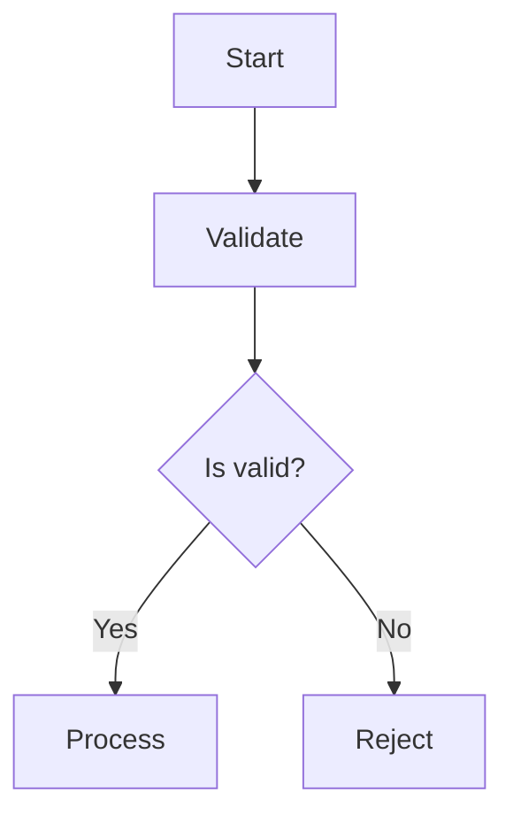
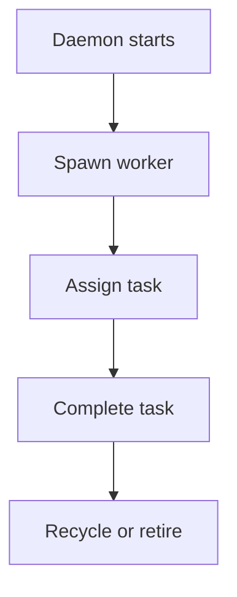
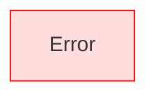
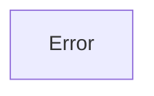
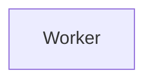

# 🧭 Comprehensive Guide: Traditional vs Object-Style Syntax in Mermaid.js

## 🌊 Introduction

Mermaid.js is a powerful tool for creating diagrams using plain text. It’s widely used in documentation, dashboards, and collaborative design environments like Veiltrace. As Mermaid evolves, it introduces new syntax styles to meet the needs of increasingly complex systems. The two primary styles for flowcharts are:

- **Traditional Syntax**: Simple, linear, and widely adopted.
- **Object-Style Syntax**: Structured, extensible, and ideal for programmatic or modular diagrams.

This guide explores both styles in depth, helping you choose the right approach for your ritual maps.

---

## 🧱 Traditional Syntax Overview

### 🔹 Structure



### 🔹 Key Elements

- **Direction**: `graph TD` (Top-Down), `LR`, `RL`, `BT`
- **Nodes**:
  - `[Label]` → Rectangle
  - `(Label)` → Rounded
  - `{Label}` → Decision
  - `((Label))` → Circle
- **Arrows**:
  - `-->` → Standard
  - `-.->` → Dotted
  - `==>` → Thick (experimental)
- **Labels**: `--> |Yes|`

### 🔹 Pros

- ✅ Easy to learn
- ✅ Quick to write
- ✅ Supported everywhere

### 🔹 Cons

- ❌ Limited customization
- ❌ Harder to scale for large diagrams
- ❌ No metadata or shape control

---

## 🧩 Object-Style Syntax Overview

### 🔹 Structure

```mermaid
flowchart TD
  A@{ shape: rect, label: "Start" }
  B@{ shape: rhombus, label: "Is valid?" }
  A --> B
```

### 🔹 Key Elements

- **Node Declaration**: `ID@{ shape: ..., label: ... }`
- **Shapes**: `rect`, `circle`, `rhombus`, `stadium`, `subroutine`, `cylinder`, `delay`, etc.
- **Attributes**:
  - `label`: Text inside the node
  - `shape`: Node type
  - `class`: CSS class
  - `link`: Hyperlink
  - `tooltip`: Hover text

### 🔹 Pros

- ✅ Highly customizable
- ✅ Easier to manage large diagrams
- ✅ Supports metadata and interactivity

### 🔹 Cons

- ❌ Slightly more verbose
- ❌ Not yet supported in all environments
- ❌ Requires newer Mermaid version

---

## 🧪 Side-by-Side Comparison

| Feature               | Traditional Syntax                  | Object-Style Syntax                          |
|----------------------|-------------------------------------|----------------------------------------------|
| Node Declaration     | `A[Label]`                          | `A@{ label: "Label", shape: "rect" }`        |
| Shape Control        | Limited (`[]`, `()`, `{}`)          | Extensive (`rect`, `rhombus`, `delay`, etc.) |
| Metadata             | Not supported                       | Supported (`tooltip`, `link`, `class`)       |
| Scalability          | Moderate                            | High                                          |
| Readability          | High for small diagrams             | High for structured diagrams                 |
| Interactivity        | Limited                             | Supported                                     |

---

## 🧾 Examples

### 🔹 Traditional Syntax: Worker Pool Lifecycle



### 🔹 Object-Style Syntax: Same Diagram

```mermaid
flowchart TD
  A@{ label: "Daemon starts", shape: stadium }
  B@{ label: "Spawn worker", shape: subroutine }
  C@{ label: "Assign task", shape: rect }
  D@{ label: "Complete task", shape: rect }
  E@{ label: "Recycle or retire", shape: rhombus }

  A --> B --> C --> D --> E
```

---

## 🧭 Use Cases

### 🔸 Traditional Syntax
- Quick sketches
- Markdown documentation
- GitHub/GitLab READMEs
- Small diagrams

### 🔸 Object-Style Syntax
- Complex systems (e.g., Veiltrace dashboard)
- Programmatic generation
- Interactive web apps
- Modular architecture maps

---

## 🧮 Styling and Classes

### 🔹 Traditional



### 🔹 Object-Style



You can define CSS classes globally or inline.

---

## 🧾 Interactivity

Object-style syntax supports:

- **Tooltips**: `tooltip: "This is a worker node"`
- **Links**: `link: "https://veiltrace.app/worker"`
- **Classes**: `class: "worker"`

Example:



---

## 🧰 Tools and Editors

- [Mermaid Live Editor](https://mermaid.live)
- [VS Code Mermaid Preview](https://marketplace.visualstudio.com/items?itemName=vstirbu.vscode-mermaid-preview)
- [Markdown Preview Enhanced](https://marketplace.visualstudio.com/items?itemName=shd101wyy.markdown-preview-enhanced)

---

## 🧾 Best Practices

- Use **traditional syntax** for quick drafts and small diagrams.
- Use **object-style syntax** for structured, interactive, or large-scale diagrams.
- Preview often to catch syntax errors.
- Comment with `%%` to annotate logic.
- Use subgraphs to group phases.

---

## 🧭 Conclusion

Mermaid’s traditional syntax is elegant and fast, perfect for lightweight documentation. But as systems grow—like Veiltrace’s modular architecture—the object-style syntax becomes essential. It offers clarity, extensibility, and symbolic control over every node.

Whether you’re sketching a ritual flow or inscribing a dashboard’s breath, Mermaid gives you the tools to shape it with intention.

Let me know if you’d like help converting your existing diagrams or shaping a new one with object-style syntax. We can inscribe it together.

---

**Sources:**  
[Mermaid Syntax Reference](http://mermaid.js.org/intro/syntax-reference.html)  
[Mermaid Getting Started Guide](https://mermaid.js.org/intro/getting-started.html)
